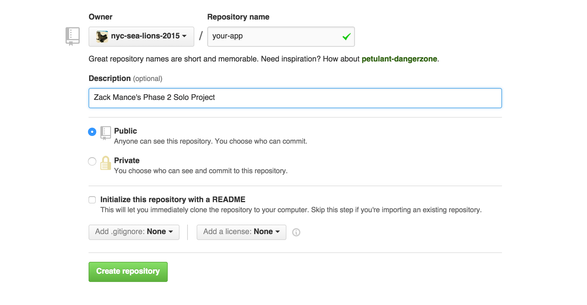

### Purpose and Overview
The following challenge is for you to demonstrate everything you've learned so far in phase 2.

The challenge is this: create a Sinatra app of your own design.

Your app should meet a minimum level of complexity and test coverage.

In descending order of importance:

1. You should have at least 3 tables and the corresponding migrations and ActiveRecord models
 * Your model classes should have sensible ActiveRecord relations (`belongs_to`, etc).
 * One of these tables must be a users table.
2. Your app should support authentication.
3. You should have specs for any custom model methods that you write.
4. You may test controllers as you see fit.
5. Implement AJAX with one `GET` request and one update (`POST`, `PUT`, or `DELETE`).

It should be fairly straightforward to come up with an app idea with about this level of complexity. Ponder it, and discuss your idea with your cohort lead in conferences Monday or Tuesday.

### Remember

1. Please give us the best representation of your work. Ensure that your code is complete, tested, and clean.
2. You have all the resources normally available to you except for a pair. Write your own code, but take advantage of coaches, your teachers, each other, and Google.
3. You should be able to talk about all the code in your app.
4. You should be able to talk about the parts of your app that you wanted to write, but didn't get to.
5. Use good git hygiene. Create branches when necessary, and make sure to merge everything back into `master` by the end of the day.
6. Breathe.

You have from 9am to 6pm to complete your app. Good luck!

### Setup
1. In the **cohorts organization** create a new repository with your app's name. It should be an empty repository. Do not initialize the repository with a README.



3. Use the following commands to clone the skeleton and push it into your repository:

```
$ git clone https://github.com/nyc-sea-lions-2015/solo-challenge
$ mv solo-challenge/ your-app/
$ cd your-app
$ git remote set-url origin https://github.com/nyc-sea-lions-2015/your-app
$ git push origin master
```

You should now be all setup to begin development. Check your repository on github and make sure everything is copascetic. If it's not, don't get snagged on this step! Get an instructor or coach to help you right away.
